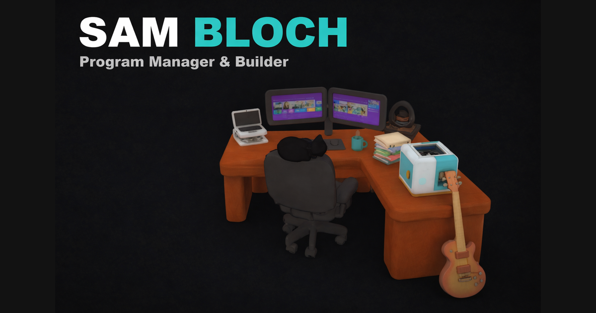
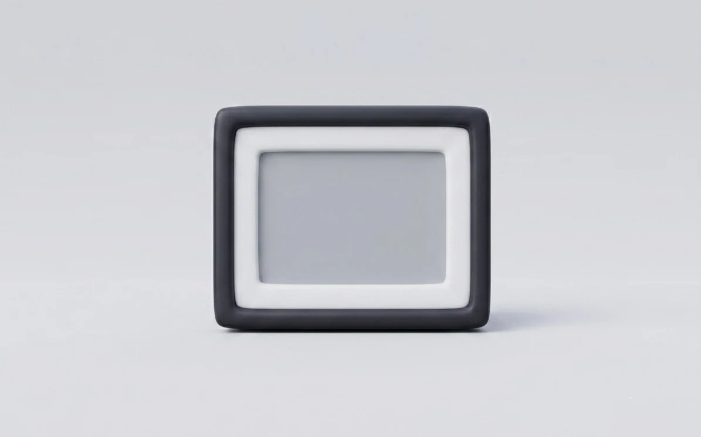
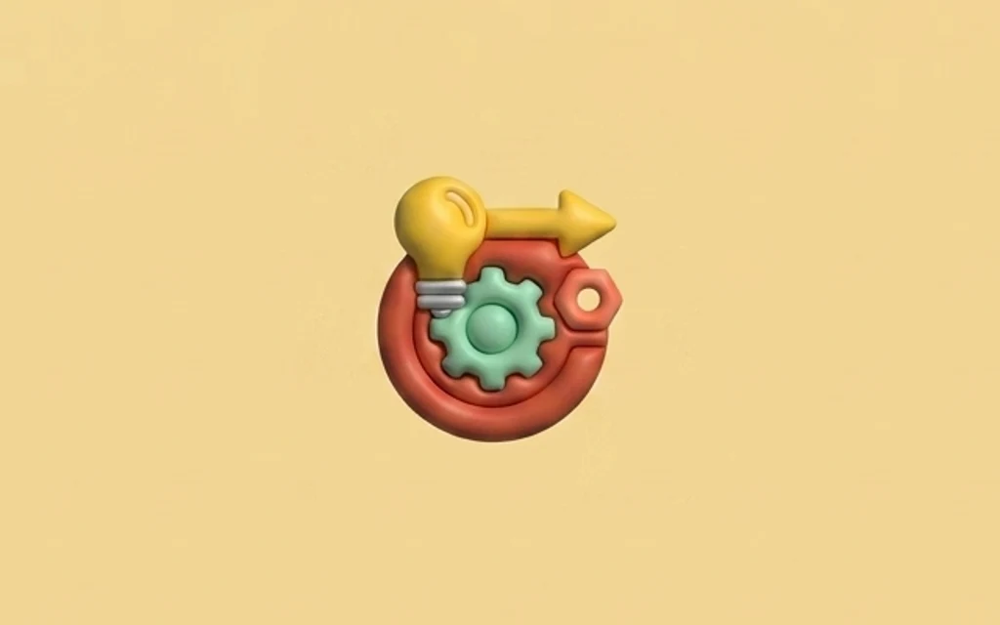
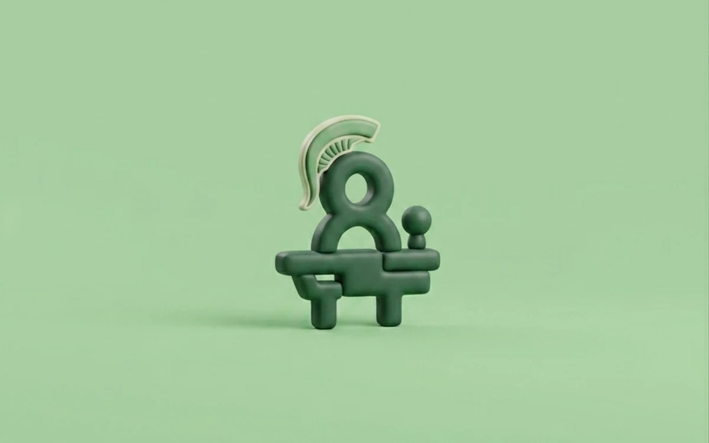

<div align="center">

<a href="https://sam-bloch.com"></a>

# The Samulation

**Architecting Human-Centric Systems · the source for [sam-bloch.com](https://sam-bloch.com)**


<sub><code>&gt; LOADING SAM-BLOCH.COM ...</code></sub>

</div>

---

This is the third rebuild of my personal site since 2020, and the first one I
built entirely in code. It opens on my actual desk rendered in 3D (click
around, find the cat), and every object on it opens into real work: eleven
case studies, each with its own design language, from an e-ink movie frame
hanging on my wall to the Trust & Safety operations I run by day. A 2D
editorial version loads automatically on mobile or whenever WebGL says no.

<div align="center">
<table>
  <tr>
    <td align="center"><a href="https://sam-bloch.com/projects/matinee"><br /><sub><b>Matinee</b></sub></a></td>
    <td align="center"><a href="https://sam-bloch.com/projects/operations"><br /><sub><b>Operations at Scale</b></sub></a></td>
    <td align="center"><a href="https://sam-bloch.com/projects/michigan-speech"><br /><sub><b>Michigan Speech</b></sub></a></td>
    <td align="center"><a href="https://sam-bloch.com/projects/fudge"><br /><sub><b>Fudge</b></sub></a></td>
  </tr>
</table>
<sub>Four of eleven. The rest live at <a href="https://sam-bloch.com/projects">sam-bloch.com/projects</a>.</sub>
</div>

## Why this repo is public

The site makes a claim: that one person with good judgment and modern AI
tools can now do work that used to take a team. A claim like that deserves
receipts. This repo is the receipts. The commit history runs from the first
line in March to launch day, including the feedback study that seventeen
people put me through and the fixes that shipped within days of it.

I built this working with AI the way a director works with a crew: setting
intent, making the judgment calls, owning every decision that shipped. If
you are curious what that actually looks like on a real project, read the
history, not the marketing.

## What to look at

| Where | What |
| --- | --- |
| `components/*CaseStudy.tsx` | Eleven case study pages, each with its own visual theme built from scratch |
| `components/ConnectButton.tsx` | The contact button my feedback study caught silently failing, rebuilt copy-first |
| `scripts/prerender.mjs` | The SEO pipeline: renders every route to static HTML in a real browser at build time |
| `scripts/vercel-build.sh` | Getting headless Chromium to run on Vercel's build image |
| `vercel.json` | Twenty redirects preserving six years of old Wix URLs |
| `api/track.ts` | Analytics with no cookies, no fingerprinting, and nothing to consent to |

## Run it

```bash
npm install
npm run dev        # localhost:3000
npm test           # Vitest + Testing Library
npm run build      # production build + pre-render all 15 routes
```

The 3D scene downloads at build time and the front end needs no environment
variables. The two API routes (analytics and a monthly report email) want
Supabase and Resend keys, and the site runs fine without them.

## How to use this

Read it, learn from it, borrow patterns from it. If a technique in here
saves you a week, that is exactly why it is public. What this repo is not:
a template. The case studies describe real work I did, the 3D scene was
hand-built in Spline over 200+ hours, and forking someone's memories makes
for a strange portfolio. If you have questions about how something works,
open an issue. I am happy to explain.

## Copyright

Code is © Sam Bloch, all rights reserved, shared here for reference. You
are welcome to study it and adapt small patterns with attribution. The
content is a harder line: the writing, case studies, photographs, resume,
and brand identity may not be republished or reused anywhere.

**TL;DR:** Look, learn, get inspired. Don't copy-paste and deploy as your own.

## Colophon

Built with [Claude Code](https://claude.com/claude-code) as the crew,
[Spline](https://spline.design) for the desk, [Gemini](https://gemini.google.com)
for the claymorphic project art, and [Vercel](https://vercel.com) under it all.

<div align="center">
<br />
<sub><i>It was time for a facelift.</i></sub>
<br /><br />
<a href="https://sam-bloch.com"><b>sam-bloch.com</b></a> · <a href="https://www.linkedin.com/in/blochsam/">LinkedIn</a>
</div>
